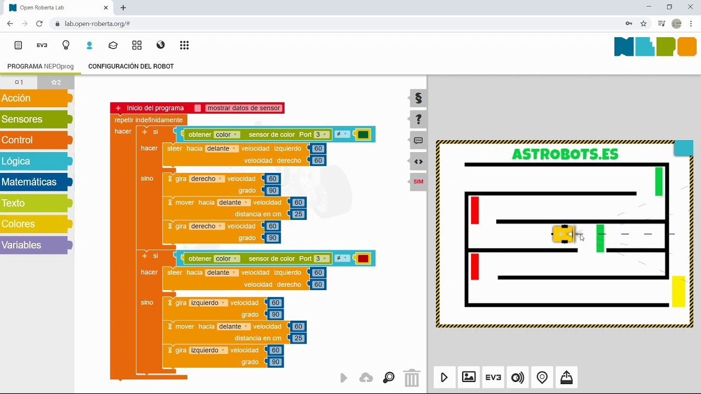
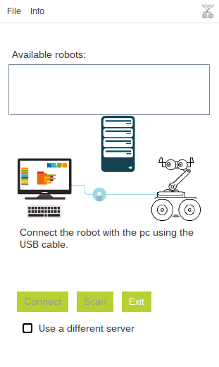
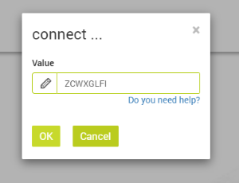

## OpenRoberta

[Open Roberta lab](https://lab.open-roberta.org/#)

### Instalación

[Open Roberta Connector](https://jira.iais.fraunhofer.de/wiki/display/ORInfo/Open+Roberta+Connector#OpenRobertaConnector-ConnectingtherobottotheOpenRobertaLab)

[Descarga](https://github.com/OpenRoberta/openroberta-connector/releases)

./install-connector 

Conectamos, obtenemos un ID que usaremos en la página para conectar con el robot

[Open Roberta Lego EV3](https://juegosrobotica.es/instalar-open-roberta/)
